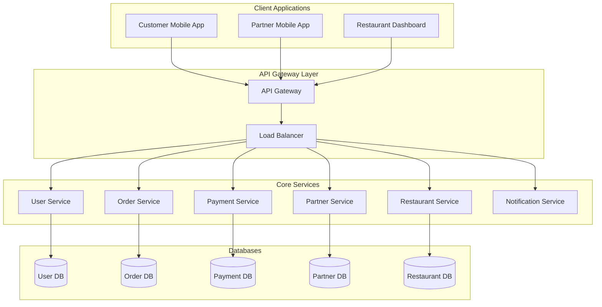
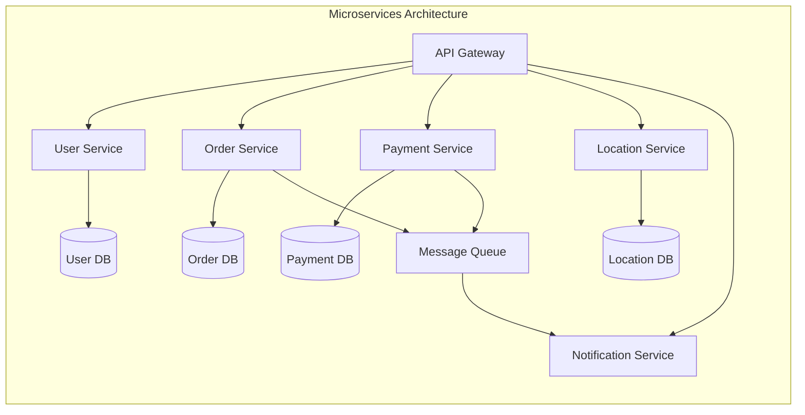
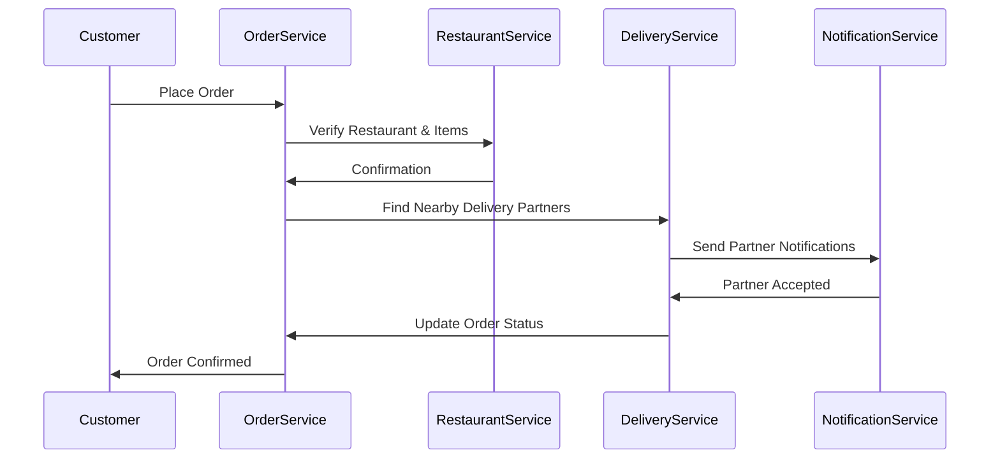
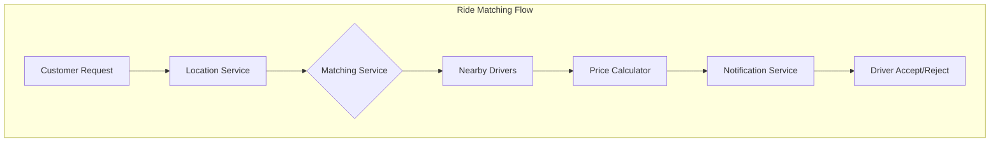
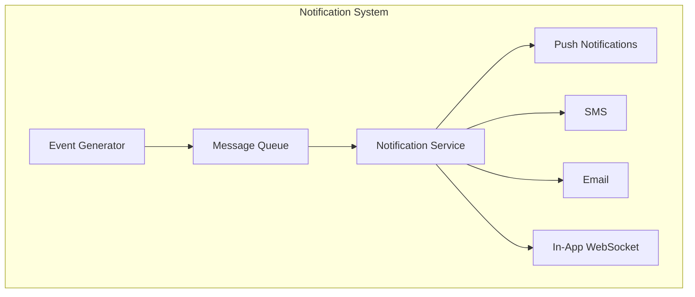

# System Architecture: Food Delivery & Ride-Hailing Platforms
## Comprehensive Technical Analysis of Swiggy, Zomato, Ola, and Uber

## Table of Contents
1. [Overview](#overview)
2. [Common Architectural Components](#common-architectural-components)
3. [Food Delivery Architecture (Swiggy/Zomato)](#food-delivery-architecture)
4. [Ride-Hailing Architecture (Ola/Uber)](#ride-hailing-architecture)
5. [Notification Systems](#notification-systems)
6. [Technology Stack](#technology-stack)
7. [Scaling Considerations](#scaling-considerations)

## Overview

These platforms follow a microservices architecture pattern with three main client applications:
- Customer App
- Partner App (Delivery/Driver)
- Restaurant/Merchant App (for food delivery)

## Common Architectural Components

### 1. API Gateway Layer
- **Technology**: Kong/AWS API Gateway
- **Features**:
  - Rate limiting
  - Authentication
  - Request routing
  - Load balancing
  - API versioning
  - Request/Response transformation

### 2. Service Layer
Each microservice is independently deployable and scalable:

## Food Delivery Architecture

### Order Flow

### Key Technologies:
- **Backend**: Node.js/Java Spring Boot
- **Databases**: 
  - PostgreSQL for transactional data
  - MongoDB for order/delivery data
  - Redis for caching
- **Message Queue**: Kafka/RabbitMQ
- **Search**: Elasticsearch
- **Maps**: Google Maps API

## Ride-Hailing Architecture

### Ride Matching System

### Location Tracking
- Real-time location updates using WebSocket
- Geohashing for efficient driver discovery
- Location data stored in Redis for quick access

## Notification Systems

### Types of Notifications

1. **Push Notifications**
   - Firebase Cloud Messaging (FCM)
   - Apple Push Notification Service (APNS)

2. **SMS Notifications**
   - Twilio
   - Local SMS gateways

3. **In-App Notifications**
   - WebSocket connections
   - Socket.io/SignalR

## Technology Stack

### Frontend Technologies
- **Mobile Apps**: 
  - iOS: Swift/SwiftUI
  - Android: Kotlin/Java
  - React Native/Flutter for cross-platform
- **Web Applications**:
  - React.js
  - Next.js
  - TypeScript

### Backend Technologies
- **Core Services**:
  - Java Spring Boot
  - Node.js
  - Python (Django/FastAPI)
- **Databases**:
  - PostgreSQL
  - MongoDB
  - Redis
  - Elasticsearch
- **Message Brokers**:
  - Apache Kafka
  - RabbitMQ
- **Caching**:
  - Redis
  - Memcached
- **Search Engine**:
  - Elasticsearch
  - Algolia

### DevOps & Infrastructure
- **Container Orchestration**:
  - Kubernetes
  - Docker
- **Cloud Providers**:
  - AWS
  - Google Cloud
  - Azure
- **Monitoring**:
  - Prometheus
  - Grafana
  - ELK Stack
- **CI/CD**:
  - Jenkins
  - GitLab CI
  - GitHub Actions

## Scaling Considerations

### 1. Database Scaling
- Horizontal sharding
- Read replicas
- Cache layers
- Database indexing strategies

### 2. Application Scaling
- Microservices architecture
- Container orchestration
- Auto-scaling policies
- Load balancing

### 3. Caching Strategy
- Multi-level caching
- Distributed caching
- Cache invalidation patterns
- Cache-aside pattern

### 4. Performance Optimization
- CDN implementation
- Image optimization
- API response compression
- Request batching

End of Document
